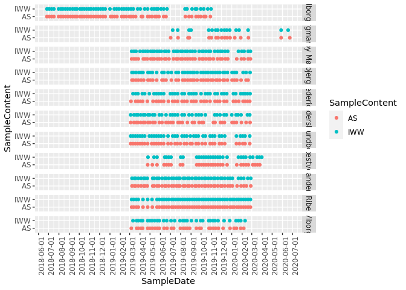
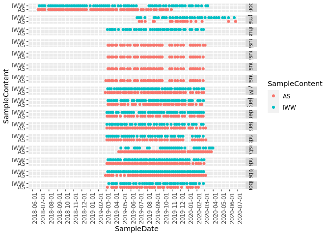
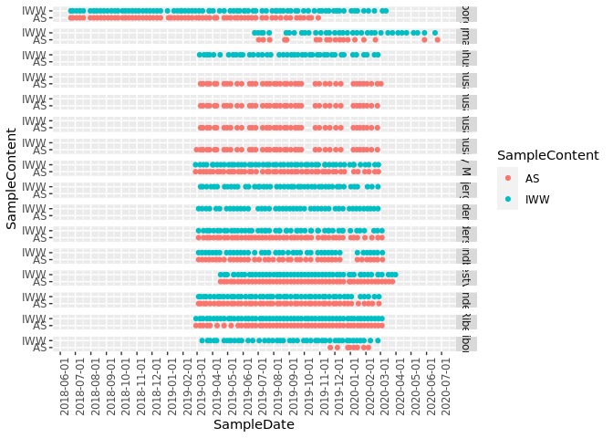

init
====

    #load data
    library(ampvis2)

    ## Loading required package: ggplot2

    library(data.table)
    library(tidyverse)

    ## ── Attaching core tidyverse packages ──────────────────────── tidyverse 2.0.0 ──
    ## ✔ dplyr     1.1.2     ✔ readr     2.1.4
    ## ✔ forcats   1.0.0     ✔ stringr   1.5.0
    ## ✔ lubridate 1.9.2     ✔ tibble    3.2.1
    ## ✔ purrr     1.0.1     ✔ tidyr     1.3.0

    ## ── Conflicts ────────────────────────────────────────── tidyverse_conflicts() ──
    ## ✖ dplyr::between()     masks data.table::between()
    ## ✖ dplyr::filter()      masks stats::filter()
    ## ✖ dplyr::first()       masks data.table::first()
    ## ✖ lubridate::hour()    masks data.table::hour()
    ## ✖ lubridate::isoweek() masks data.table::isoweek()
    ## ✖ dplyr::lag()         masks stats::lag()
    ## ✖ dplyr::last()        masks data.table::last()
    ## ✖ lubridate::mday()    masks data.table::mday()
    ## ✖ lubridate::minute()  masks data.table::minute()
    ## ✖ lubridate::month()   masks data.table::month()
    ## ✖ lubridate::quarter() masks data.table::quarter()
    ## ✖ lubridate::second()  masks data.table::second()
    ## ✖ purrr::transpose()   masks data.table::transpose()
    ## ✖ lubridate::wday()    masks data.table::wday()
    ## ✖ lubridate::week()    masks data.table::week()
    ## ✖ lubridate::yday()    masks data.table::yday()
    ## ✖ lubridate::year()    masks data.table::year()
    ## ℹ Use the conflicted package (<http://conflicted.r-lib.org/>) to force all conflicts to become errors

    library(lubridate)
    library(foreach)

    ## 
    ## Attaching package: 'foreach'
    ## 
    ## The following objects are masked from 'package:purrr':
    ## 
    ##     accumulate, when

    library(doFuture)

    ## Loading required package: future

    if (interactive()) {
      if (!grepl("data/Immigration$", getwd())) {
        setwd("data/Immigration")
      }
    }

load and fix metadata
=====================

    metadata <- openxlsx::read.xlsx(
      "metadata_IDs_complete_20230207.xlsx",
      detectDates = TRUE
    )
    setDT(metadata)

    #adjust columns
    metadata[, Replicate := as.integer(Replicate)]
    metadata[, SampleDate := ymd(SampleDate)]
    metadata[, YearWeek := paste(year(SampleDate), week(SampleDate), sep = "-")]

    #ensure names are consistent from the same WWTPs
    metadata[
      ,
      SampleSite := str_replace_all(
        SampleSite,
        c(
          "Aalborg West" = "Aalborg W",
          "Esbjerg West" = "Esbjerg W",
          "Naestved" = "Næstved"
        )
      )
    ]
    #Aalborg West started with S::Select for 6 time points,
    #will be different than usual and mess up any predictions, so remove
    metadata <- metadata[
      !LineAS %chin% "S::Select" &
        SampleContent %chin% c("IWW", "AS") &
        !grepl("extneg|pcrpos|pcrneg", LibraryID, ignore.case = TRUE) &
        !PrimarySettler %chin% "before"
    ]

    #each WWTP must have both IWW+AS samples
    metadata <- metadata[
      ,
      .SD[
        !length(unique(SampleContent)) != 2
      ],
      by = "SampleSite"
    ]

    #Damhusåen has 4 separate AS lines with the same IWW
    metadata[
      SampleSite == "Damhusåen" &
        SampleContent == "AS",
      SampleSite := paste(SampleSite, LineAS, sep = "-")
    ]

    #Filter replicates, just use the first for each time point
    metadata <- metadata[
      ,
      .SD[1],
      by = c("SampleSite", "YearWeek", "SampleContent"),
      .SDcols = c("SampleDate", "SampleID")
    ]

    #Reorder with Sample ID's first
    metadata <- metadata[
      ,
      c(
        "SampleID",
        "SampleSite",
        "SampleDate",
        "YearWeek",
        "SampleContent"
      )
    ]

    #Filter time points without both IWW+AS pair of samples.
    metadata_pairs <- metadata[
      ,
      .SD[
        length(unique(SampleContent)) == 2
      ],
      by = c("SampleSite", "YearWeek")
    ]

load with ampvis2
=================

    d <- amp_load(
      otutable = "ASVtable.zip",
      metadata = metadata,
      taxonomy = "ASVs.R1.sintax.zip",
      fasta = "ASVs.R1.zip",
    )

    ## Warning: Only 1065 of 2092 unique sample names match between metadata and otutable. The following unmatched samples have been removed:
    ## metadata (113): 
    ##  "MQ201110-118", "MQ201110-119", "MQ201110-120", "MQ201110-121", "MQ201110-122", "MQ201110-123", "MQ201110-124", "MQ201110-125", "MQ201110-126", "MQ201110-127", "MQ201110-128", "MQ201110-129", "MQ201110-130", "MQ201110-138", "MQ201110-139", "MQ201110-140", "MQ201110-142", "MQ201110-144", "MQ201110-145", "MQ201110-146", "MQ201110-148", "MQ201110-149", "MQ201110-150", "MQ201110-151", "MQ201110-152", "MQ201110-153", "MQ201110-154", "MQ201110-155", "MQ201110-156", "MQ201110-157", "MQ201110-158", "MQ201110-160", "MQ201110-161", "MQ201110-162", "MQ201110-163", "MQ201110-164", "MQ201110-165", "MQ201110-166", "MQ201110-167", "MQ201110-169", "MQ201110-171", "MQ201110-172", "MQ201110-190", "MQ201110-191", "MQ201110-192", "MQ201110-193", "MQ201110-194", "MQ201110-196", "MQ201110-197", "MQ201110-199", "MQ201110-200", "MQ201110-201", "MQ201110-203", "MQ201110-204", "MQ201110-205", "MQ201110-206", "MQ201110-188", "MQ221010-225", "MQ221010-226", "MQ221010-227", "MQ221010-228", "MQ221010-229", "MQ221010-230", "MQ221010-232", "MQ221010-234", "MQ221010-235", "MQ221010-236", "MQ221010-237", "MQ221010-238", "MQ221010-240", "MQ221010-242", "MQ221010-243", "MQ221010-244", "MQ221010-246", "MQ221010-247", "MQ221010-248", "MQ221010-250", "MQ221010-251", "MQ221010-252", "MQ221010-253", "MQ221010-254", "MQ200121-17", "MQ200121-19", "MQ200121-20", "MQ200121-21", "MQ200121-22", "MQ200121-24", "MQ200121-25", "MQ200121-26", "MQ200121-27", "MQ200121-28", "MQ200121-29", "MQ200121-30", "MQ200121-31", "MQ200121-32", "MQ200121-33", "MQ200121-34", "MQ200121-35", "MQ200121-37", "MQ200121-38", "MQ200121-39", "MQ200121-40", "MQ200121-41", "MQ200121-42", "MQ200121-44", "MQ200121-45", "MQ200121-46", "MQ200121-47", "MQ200121-49", "MQ200121-50", "MQ200121-51", "MQ200121-52", "MQ200121-53"
    ## otutable (914): 
    ##  "MQ190702-124", "MQ190702-126", "MQ190702-128", "MQ190702-130", "MQ190702-132", "MQ190702-134", "MQ190702-136", "MQ190702-138", "MQ190702-140", "MQ190702-142", "MQ190702-144", "MQ190702-146", "MQ190702-148", "MQ190702-150", "MQ190702-152", "MQ190702-154", "MQ190702-156", "MQ190702-158", "MQ190702-160", "MQ190702-162", "MQ190702-164", "MQ190702-166", "MQ190702-168", "MQ190702-170", "MQ190702-172", "MQ190702-178", "MQ190702-180", "MQ190702-182", "MQ190702-184", "MQ190702-186", "MQ190702-188", "MQ190702-190", "MQ190702-193", "MQ190702-195", "MQ190702-197", "MQ200420-66", "MQ200420-67", "MQ200420-70", "MQ200420-73", "MQ200420-82", "MQ200420-85", "MQ200420-89", "MQ200420-92", "MQ200420-99", "MQ200420-100", "MQ201009-1", "MQ201009-2", "MQ201009-3", "MQ201009-4", "MQ201009-5", "MQ201009-6", "MQ201009-7", "MQ201009-8", "MQ201009-9", "MQ201009-10", "MQ201009-11", "MQ201009-12", "MQ201030-6", "MQ201030-7", "MQ201030-8", "MQ201030-9", "MQ201030-10", "MQ201030-17", "MQ190919-36", "MQ190919-93", "MQ190919-198", "MQ190919-253", "MQ190919-39", "MQ190919-96", "MQ190919-201", "MQ190919-256", "MQ190919-40", "MQ190919-97", "MQ190919-202", "MQ190919-257", "MQ190919-42", "MQ190919-99", "MQ190919-204", "MQ190919-259", "MQ190919-44", "MQ190919-101", "MQ190919-206", "MQ190919-261", "MQ200528-56", "MQ200528-84", "MQ200528-115", "MQ200528-143", "MQ200528-59", "MQ200528-87", "MQ200528-118", "MQ200528-146", "MQ200528-62", "MQ200528-90", "MQ200528-121", "MQ200528-149", "MQ200528-71", "MQ200528-99", "MQ200528-130", "MQ200528-158", "MQ201030-100", "MQ201030-121", "MQ201030-128", "MQ201030-130", "MQ201030-132", "MQ201030-135", "MQ210115-167", "MQ210115-169", "MQ210115-171", "MQ201030-183", "MQ201030-190", "MQ201030-193", "MQ201030-197", "MQ201030-202", "MQ201030-206", "MQ201030-217", "MQ210118-56", "MQ201118-152", "MQ201118-154", "MQ201118-158", "MQ201118-160", "MQ210118-64", "MQ201009-44", "MQ201009-45", "MQ201009-46", "MQ201009-47", "MQ201009-48", "MQ201009-49", "MQ201009-50", "MQ201009-51", "MQ201009-52", "MQ201009-53", "MQ201009-54", "MQ201009-55", "MQ201009-56", "MQ201009-57", "MQ201009-58", "MQ201009-59", "MQ201009-60", "MQ201009-61", "MQ201009-62", "MQ201009-63", "MQ201009-64", "MQ201009-65", "MQ201009-66", "MQ201009-67", "MQ201009-68", "MQ201009-69", "MQ201009-70", "MQ201009-71", "MQ201009-72", "MQ201009-73", "MQ201009-74", "MQ201009-75", "MQ201009-76", "MQ201009-80", "MQ201009-81", "MQ201009-82", "MQ201009-83", "MQ201009-84", "MQ201009-85", "MQ201009-86", "MQ201009-87", "MQ201009-88", "MQ201009-89", "MQ201009-90", "MQ201009-91", "MQ201009-92", "MQ201009-93", "MQ201009-94", "MQ201009-95", "MQ201009-96", "MQ201009-97", "MQ201009-98", "MQ201009-99", "MQ210414-1", "MQ210414-2", "MQ210414-3", "MQ210414-4", "MQ210414-5", "MQ210414-6", "MQ210414-7", "MQ210414-8", "MQ210414-9", "MQ210414-10", "MQ210414-11", "MQ210414-12", "MQ210414-13", "MQ210414-14", "MQ210414-15", "MQ210414-16", "MQ210414-17", "MQ210414-18", "MQ210414-19", "MQ210414-20", "MQ210414-21", "MQ210414-22", "MQ210414-23", "MQ210414-24", "MQ210414-25", "MQ210414-26", "MQ210414-27", "MQ210414-28", "MQ210414-29", "MQ210414-30", "MQ210414-31", "MQ210414-32", "MQ210414-33", "MQ210414-34", "MQ210414-35", "MQ210414-36", "MQ210414-37", "MQ210414-38", "MQ210414-39", "MQ210414-40", "MQ210414-41", "MQ210414-42", "MQ210414-43", "MQ210414-44", "MQ210414-45", "MQ210414-46", "MQ210414-47", "MQ210414-48", "MQ210414-49", "MQ210414-50", "MQ210414-51", "MQ210414-52", "MQ210414-53", "MQ210414-54", "MQ210414-55", "MQ200330-2", "MQ200330-4", "MQ200330-6", "MQ200330-8", "MQ200330-9", "MQ200330-10", "MQ200330-12", "MQ200330-14", "MQ200330-16", "MQ200330-18", "MQ200330-20", "MQ200330-22", "MQ200330-24", "MQ200330-26", "MQ200330-28", "MQ200330-30", "MQ200330-31", "MQ200330-32", "MQ200330-34", "MQ200330-36", "MQ200330-38", "MQ200330-40", "MQ200330-42", "MQ200330-44", "MQ200330-46", "MQ200330-48", "MQ200330-50", "MQ200330-52", "MQ200330-54", "MQ200330-55", "MQ200330-56", "MQ200330-58", "MQ200330-60", "MQ200330-62", "MQ200330-64", "MQ200330-66", "MQ200330-68", "MQ200330-70", "MQ200330-71", "MQ200330-72", "MQ200330-74", "MQ200330-76", "MQ200330-77", "MQ200330-78", "MQ200330-79", "MQ200420-2", "MQ200420-4", "MQ200420-5", "MQ200420-6", "MQ200420-8", "MQ200420-10", "MQ200420-12", "MQ200420-14", "MQ200420-16", "MQ200420-18", "MQ200420-20", "MQ200420-22", "MQ200420-24", "MQ200420-26", "MQ200420-63", "MQ200420-64", "MQ200420-65", "MQ210416-2", "MQ210416-4", "MQ210416-6", "MQ210416-8", "MQ210416-10", "MQ210416-12", "MQ210416-14", "MQ210416-16", "MQ210416-18", "MQ210416-20", "MQ210416-22", "MQ210416-24", "MQ210416-26", "MQ210416-28", "MQ210416-30", "MQ210416-32", "MQ210416-34", "MQ210416-36", "MQ210416-38", "MQ210416-39", "MQ210416-40", "MQ210416-41", "MQ210416-42", "MQ210416-44", "MQ210416-46", "MQ210416-48", "MQ210416-49", "MQ210416-50", "MQ210416-52", "MQ210416-54", "MQ210416-55", "MQ210416-56", "MQ210416-58", "MQ210416-60", "MQ210416-61", "MQ210416-62", "MQ210416-63", "MQ200420-27", "MQ200420-28", "MQ200420-29", "MQ200420-30", "MQ200420-31", "MQ200420-32", "MQ200420-33", "MQ200420-34", "MQ200420-35", "MQ200420-36", "MQ200420-37", "MQ200420-38", "MQ200420-39", "MQ200420-40", "MQ200420-41", "MQ200420-42", "MQ200420-43", "MQ200420-44", "MQ200420-45", "MQ200420-46", "MQ200420-47", "MQ200420-48", "MQ200420-49", "MQ200420-50", "MQ200420-51", "MQ200420-52", "MQ200420-53", "MQ200420-54", "MQ200420-55", "MQ200420-56", "MQ200420-57", "MQ200420-58", "MQ200420-59", "MQ200420-60", "MQ200420-61", "MQ200420-62", "MQ211011-71", "MQ211011-72", "MQ211011-73", "MQ211011-74", "MQ211011-75", "MQ211011-76", "MQ211011-77", "MQ211011-78", "MQ211011-79", "MQ211011-80", "MQ211011-81", "MQ211011-82", "MQ211011-83", "MQ211011-84", "MQ211011-85", "MQ211011-86", "MQ211011-87", "MQ211011-88", "MQ211011-89", "MQ211011-90", "MQ211011-91", "MQ211011-92", "MQ211011-93", "MQ211011-94", "MQ211011-95", "MQ211011-96", "MQ211011-97", "MQ211011-98", "MQ211011-99", "MQ211011-100", "MQ211011-101", "MQ211011-102", "MQ211011-103", "MQ211011-104", "MQ211011-105", "MQ210420-92", "MQ210420-102", "MQ210420-107", "MQ210420-112", "MQ210420-119", "MQ210420-121", "MQ210420-122", "MQ210420-125", "MQ210420-126", "MQ210420-127", "MQ210602-2", "MQ210602-4", "MQ210602-6", "MQ210602-8", "MQ21060

    ## 713 OTUs with 0 total abundance across all samples have been removed.

create fake samples filling in with -1 abundances where no matching IWW+AS pair
===============================================================================

    # for each WWTP ensure there's a pair of IWW+AS in metadata
    # even though not present in abundance table. "Densify"/interpolate
    full_metadata <- d$metadata %>%
      group_by(SampleSite) %>%
      expand(YearWeek, SampleContent) %>%
      data.table()

    # merge with sparse metadata
    full_metadata <- merge(
      full_metadata,
      d$metadata,
      by = c("SampleSite", "YearWeek", "SampleContent"),
      all.x = TRUE
    )

    #remove fake samples where there's an IWW sample but no AS (can't predict AS with onle -1's)
    full_metadata <- full_metadata[!(is.na(SampleID) & SampleContent == "AS")]

    # create sample ID's based on wwtp+year+week+location
    full_metadata[, oldSampleID := factor(SampleID, levels = colnames(d$abund))]
    full_metadata[
      ,
      SampleID := paste(
        SampleSite,
        YearWeek,
        SampleContent
      )
    ]

    # fill in dates from the twin when missing
    full_metadata[
      ,
      SampleDate := if(any(is.na(SampleDate))) {
        na.omit(SampleDate)[1]
      } else {
        SampleDate
      },
      by = c("SampleSite", "YearWeek")]

    # reorder based on abund
    setorder(
      full_metadata,
      oldSampleID
    )

    # rename columns in abund based on new sample IDs and add missing ones with -1
    colnames(d$abund) <- full_metadata[oldSampleID %in% colnames(d$abund), SampleID]
    d$abund[, full_metadata[!SampleID %chin% colnames(d$abund), SampleID]] <- -1

    # ensure order is the same and they contain the same sample IDs
    d$abund <- d$abund[, full_metadata[, SampleID]]
    full_metadata <- full_metadata[
      ,
      c(
        "SampleID",
        "oldSampleID",
        "SampleSite",
        "SampleDate",
        "YearWeek",
        "SampleContent"
      )
    ]
    setDF(full_metadata, rownames = full_metadata[, SampleID])
    d$metadata <- full_metadata

Sample overview, filtered
=========================

    ggplot(
      metadata_pairs,
      aes(x = SampleDate, y = SampleContent, color = SampleContent)
    ) +
      geom_point() +
      facet_grid(rows = vars(SampleSite)) +
      scale_x_date(date_breaks = "months") +
      theme(axis.text.x = element_text(angle = 90))

    ggsave(file.path("overview plots", "sample_overview.png"), height = 18, width = 12)

Sample overview, unmatched
==========================

    ggplot(
      metadata,
      aes(x = SampleDate, y = SampleContent, color = SampleContent)
    ) +
      geom_point() +
      facet_grid(rows = vars(SampleSite)) +
      scale_x_date(date_breaks = "months") +
      theme(axis.text.x = element_text(angle = 90))

    ggsave(file.path("overview plots", "sample_overview_unfiltered.png"), height = 18, width = 12)

Sample overview, with fake abundances (-1)
==========================================

    ggplot(
      d$metadata,
      aes(x = SampleDate, y = SampleContent, color = SampleContent)
    ) +
      geom_point() +
      facet_grid(rows = vars(SampleSite)) +
      scale_x_date(date_breaks = "months") +
      theme(axis.text.x = element_text(angle = 90))

    ggsave(file.path("overview plots", "sample_overview_unfiltered_fakes.png"), height = 18, width = 12)

split into separate files for each WWTP
=======================================

    # remove data from WWTPs with no twins (hasn't been sequenced yet I guess)
    # mainly esbjerg w+fredericia
    metadata_twins <- d$metadata %>%
      group_by(SampleSite) %>%
      filter(length(unique(SampleContent)) > 1)
    ds <- amp_filter_samples(
      d,
      SampleID %in% metadata_twins$SampleID
    )

    ## 341 samples and 1322 OTUs have been filtered 
    ## Before: 1118 samples and 97894 OTUs
    ## After: 777 samples and 96572 OTUs

    future::plan(future::multisession, workers = 16)

    outlist <- foreach(
      wwtp = unique(ds$metadata$SampleSite)
    ) %dofuture% {
        message("Dataset: ", wwtp)
        if(!grepl("^Damhus", wwtp)) {
          dataset <- filter_otus(
            amp_subset_samples(
              ds,
              SampleSite %chin% wwtp,
              normalise = FALSE
            ),
            0.1
          )

          #unfiltered
          dataset_IWW <- amp_subset_samples(
            dataset,
            SampleContent %chin% "IWW",
            removeAbsentOTUs = FALSE
          )
          dataset_AS <- amp_subset_samples(
            dataset,
            SampleContent %chin% "AS",
            removeAbsentOTUs = FALSE
          )

          #filtered
          dataset_filtered <- amp_subset_samples(
            dataset,
            oldSampleID %in% metadata_pairs$SampleID,
            removeAbsentOTUs = FALSE
          )
          dataset_filt_IWW <- amp_subset_samples(
            dataset_filtered,
            SampleContent %chin% "IWW",
            removeAbsentOTUs = FALSE
          )
          dataset_filt_AS <- amp_subset_samples(
            dataset_filtered,
            SampleContent %chin% "AS",
            removeAbsentOTUs = FALSE
          )

          exported_data_dir <- "datasets"

          dataset_dir_IWW <- file.path(exported_data_dir, "unfiltered", wwtp, "IWW")
          dataset_dir_AS <- file.path(exported_data_dir, "unfiltered", wwtp, "AS")
          dataset_dir_filt_IWW <- file.path(exported_data_dir, "filtered", wwtp, "IWW")
          dataset_dir_filt_AS <- file.path(exported_data_dir, "filtered", wwtp, "AS")

          dir.create(dataset_dir_IWW, mode = "0775", recursive = TRUE)
          dir.create(dataset_dir_AS, mode = "0775", recursive = TRUE)
          dir.create(dataset_dir_filt_IWW, mode = "0775", recursive = TRUE)
          dir.create(dataset_dir_filt_AS, mode = "0775", recursive = TRUE)

          #write out abundance tables
          #IWW
          fwrite(
            data.table(
              ASV = rownames(dataset_IWW$abund),
              dataset_IWW$abund
            ),
            file = file.path(dataset_dir_IWW, "ASVtable.csv")
          )
          fwrite(
            data.table(
              ASV = rownames(dataset_filt_IWW$abund),
              dataset_filt_IWW$abund
            ),
            file = file.path(dataset_dir_filt_IWW, "ASVtable.csv")
          )
          #AS
          fwrite(
            data.table(
              ASV = rownames(dataset_AS$abund),
              dataset_AS$abund
            ),
            file = file.path(dataset_dir_AS, "ASVtable.csv")
          )
          fwrite(
            data.table(
              ASV = rownames(dataset_filt_AS$abund),
              dataset_filt_AS$abund
            ),
            file = file.path(dataset_dir_filt_AS, "ASVtable.csv")
          )

          #write out taxonomy
          #IWW
          fwrite(
            dataset_IWW$tax,
            file = file.path(dataset_dir_IWW, "taxonomy.csv")
          )
          fwrite(
            dataset_filt_IWW$tax,
            file = file.path(dataset_dir_filt_IWW, "taxonomy.csv")
          )
          #AS
          fwrite(
            dataset_AS$tax,
            file = file.path(dataset_dir_AS, "taxonomy.csv")
          )
          fwrite(
            dataset_filt_AS$tax,
            file = file.path(dataset_dir_filt_AS, "taxonomy.csv")
          )

          #write out metadata
          #IWW
          fwrite(
            dataset_IWW$metadata,
            file = file.path(dataset_dir_IWW, "metadata.csv")
          )
          fwrite(
            dataset_filt_IWW$metadata,
            file = file.path(dataset_dir_filt_IWW, "metadata.csv")
          )
          #AS
          fwrite(
            dataset_AS$metadata,
            file = file.path(dataset_dir_AS, "metadata.csv")
          )
          fwrite(
            dataset_filt_AS$metadata,
            file = file.path(dataset_dir_filt_AS, "metadata.csv")
          )

          dataset
        }
      }

    ## Dataset: Aalborg W

    ## 641 samples and 23276 OTUs have been filtered 
    ## Before: 777 samples and 96572 OTUs
    ## After: 136 samples and 73296 OTUs

    ## 72075 OTUs not present in more than 0.1% relative abundance in any sample have been filtered 
    ## Before: 73296 OTUs
    ## After: 1221 OTUs

    ## 64 samples and 0 OTUs have been filtered 
    ## Before: 136 samples and 1221 OTUs
    ## After: 72 samples and 1221 OTUs

    ## 72 samples and 0 OTUs have been filtered 
    ## Before: 136 samples and 1221 OTUs
    ## After: 64 samples and 1221 OTUs

    ## 26 samples and 0 OTUs have been filtered 
    ## Before: 136 samples and 1221 OTUs
    ## After: 110 samples and 1221 OTUs

    ## 55 samples and 0 OTUs have been filtered 
    ## Before: 110 samples and 1221 OTUs
    ## After: 55 samples and 1221 OTUs
    ## 55 samples and 0 OTUs have been filtered 
    ## Before: 110 samples and 1221 OTUs
    ## After: 55 samples and 1221 OTUs

    ## Warning in dir.create(dataset_dir_IWW, mode = "0775", recursive = TRUE):
    ## 'datasets/unfiltered/Aalborg W/IWW' already exists

    ## Warning in dir.create(dataset_dir_AS, mode = "0775", recursive = TRUE):
    ## 'datasets/unfiltered/Aalborg W/AS' already exists

    ## Warning in dir.create(dataset_dir_filt_IWW, mode = "0775", recursive = TRUE):
    ## 'datasets/filtered/Aalborg W/IWW' already exists

    ## Warning in dir.create(dataset_dir_filt_AS, mode = "0775", recursive = TRUE):
    ## 'datasets/filtered/Aalborg W/AS' already exists

    ## Dataset: Bjergmarken

    ## 725 samples and 37150 OTUs have been filtered 
    ## Before: 777 samples and 96572 OTUs
    ## After: 52 samples and 59422 OTUs

    ## 58737 OTUs not present in more than 0.1% relative abundance in any sample have been filtered 
    ## Before: 59422 OTUs
    ## After: 685 OTUs

    ## 18 samples and 0 OTUs have been filtered 
    ## Before: 52 samples and 685 OTUs
    ## After: 34 samples and 685 OTUs

    ## 34 samples and 0 OTUs have been filtered 
    ## Before: 52 samples and 685 OTUs
    ## After: 18 samples and 685 OTUs

    ## 18 samples and 0 OTUs have been filtered 
    ## Before: 52 samples and 685 OTUs
    ## After: 34 samples and 685 OTUs

    ## 17 samples and 0 OTUs have been filtered 
    ## Before: 34 samples and 685 OTUs
    ## After: 17 samples and 685 OTUs
    ## 17 samples and 0 OTUs have been filtered 
    ## Before: 34 samples and 685 OTUs
    ## After: 17 samples and 685 OTUs

    ## Warning in dir.create(dataset_dir_IWW, mode = "0775", recursive = TRUE):
    ## 'datasets/unfiltered/Bjergmarken/IWW' already exists

    ## Warning in dir.create(dataset_dir_AS, mode = "0775", recursive = TRUE):
    ## 'datasets/unfiltered/Bjergmarken/AS' already exists

    ## Warning in dir.create(dataset_dir_filt_IWW, mode = "0775", recursive = TRUE):
    ## 'datasets/filtered/Bjergmarken/IWW' already exists

    ## Warning in dir.create(dataset_dir_filt_AS, mode = "0775", recursive = TRUE):
    ## 'datasets/filtered/Bjergmarken/AS' already exists

    ## Dataset: Ejby Mølle

    ## 683 samples and 28780 OTUs have been filtered 
    ## Before: 777 samples and 96572 OTUs
    ## After: 94 samples and 67792 OTUs

    ## 67084 OTUs not present in more than 0.1% relative abundance in any sample have been filtered 
    ## Before: 67792 OTUs
    ## After: 708 OTUs

    ## 48 samples and 0 OTUs have been filtered 
    ## Before: 94 samples and 708 OTUs
    ## After: 46 samples and 708 OTUs

    ## 46 samples and 0 OTUs have been filtered 
    ## Before: 94 samples and 708 OTUs
    ## After: 48 samples and 708 OTUs

    ## 8 samples and 0 OTUs have been filtered 
    ## Before: 94 samples and 708 OTUs
    ## After: 86 samples and 708 OTUs

    ## 43 samples and 0 OTUs have been filtered 
    ## Before: 86 samples and 708 OTUs
    ## After: 43 samples and 708 OTUs
    ## 43 samples and 0 OTUs have been filtered 
    ## Before: 86 samples and 708 OTUs
    ## After: 43 samples and 708 OTUs

    ## Warning in dir.create(dataset_dir_IWW, mode = "0775", recursive = TRUE):
    ## 'datasets/unfiltered/Ejby Mølle/IWW' already exists

    ## Warning in dir.create(dataset_dir_AS, mode = "0775", recursive = TRUE):
    ## 'datasets/unfiltered/Ejby Mølle/AS' already exists

    ## Warning in dir.create(dataset_dir_filt_IWW, mode = "0775", recursive = TRUE):
    ## 'datasets/filtered/Ejby Mølle/IWW' already exists

    ## Warning in dir.create(dataset_dir_filt_AS, mode = "0775", recursive = TRUE):
    ## 'datasets/filtered/Ejby Mølle/AS' already exists

    ## Dataset: Haderslev

    ## 691 samples and 31158 OTUs have been filtered 
    ## Before: 777 samples and 96572 OTUs
    ## After: 86 samples and 65414 OTUs

    ## 64454 OTUs not present in more than 0.1% relative abundance in any sample have been filtered 
    ## Before: 65414 OTUs
    ## After: 960 OTUs

    ## 48 samples and 0 OTUs have been filtered 
    ## Before: 86 samples and 960 OTUs
    ## After: 38 samples and 960 OTUs

    ## 38 samples and 0 OTUs have been filtered 
    ## Before: 86 samples and 960 OTUs
    ## After: 48 samples and 960 OTUs

    ## 12 samples and 0 OTUs have been filtered 
    ## Before: 86 samples and 960 OTUs
    ## After: 74 samples and 960 OTUs

    ## 37 samples and 0 OTUs have been filtered 
    ## Before: 74 samples and 960 OTUs
    ## After: 37 samples and 960 OTUs
    ## 37 samples and 0 OTUs have been filtered 
    ## Before: 74 samples and 960 OTUs
    ## After: 37 samples and 960 OTUs

    ## Warning in dir.create(dataset_dir_IWW, mode = "0775", recursive = TRUE):
    ## 'datasets/unfiltered/Haderslev/IWW' already exists

    ## Warning in dir.create(dataset_dir_AS, mode = "0775", recursive = TRUE):
    ## 'datasets/unfiltered/Haderslev/AS' already exists

    ## Warning in dir.create(dataset_dir_filt_IWW, mode = "0775", recursive = TRUE):
    ## 'datasets/filtered/Haderslev/IWW' already exists

    ## Warning in dir.create(dataset_dir_filt_AS, mode = "0775", recursive = TRUE):
    ## 'datasets/filtered/Haderslev/AS' already exists

    ## Dataset: Kalundborg

    ## 698 samples and 34136 OTUs have been filtered 
    ## Before: 777 samples and 96572 OTUs
    ## After: 79 samples and 62436 OTUs

    ## 61656 OTUs not present in more than 0.1% relative abundance in any sample have been filtered 
    ## Before: 62436 OTUs
    ## After: 780 OTUs

    ## 41 samples and 0 OTUs have been filtered 
    ## Before: 79 samples and 780 OTUs
    ## After: 38 samples and 780 OTUs

    ## 38 samples and 0 OTUs have been filtered 
    ## Before: 79 samples and 780 OTUs
    ## After: 41 samples and 780 OTUs

    ## 3 samples and 0 OTUs have been filtered 
    ## Before: 79 samples and 780 OTUs
    ## After: 76 samples and 780 OTUs

    ## 38 samples and 0 OTUs have been filtered 
    ## Before: 76 samples and 780 OTUs
    ## After: 38 samples and 780 OTUs
    ## 38 samples and 0 OTUs have been filtered 
    ## Before: 76 samples and 780 OTUs
    ## After: 38 samples and 780 OTUs

    ## Warning in dir.create(dataset_dir_IWW, mode = "0775", recursive = TRUE):
    ## 'datasets/unfiltered/Kalundborg/IWW' already exists

    ## Warning in dir.create(dataset_dir_AS, mode = "0775", recursive = TRUE):
    ## 'datasets/unfiltered/Kalundborg/AS' already exists

    ## Warning in dir.create(dataset_dir_filt_IWW, mode = "0775", recursive = TRUE):
    ## 'datasets/filtered/Kalundborg/IWW' already exists

    ## Warning in dir.create(dataset_dir_filt_AS, mode = "0775", recursive = TRUE):
    ## 'datasets/filtered/Kalundborg/AS' already exists

    ## Dataset: Næstved

    ## 696 samples and 26532 OTUs have been filtered 
    ## Before: 777 samples and 96572 OTUs
    ## After: 81 samples and 70040 OTUs

    ## 69333 OTUs not present in more than 0.1% relative abundance in any sample have been filtered 
    ## Before: 70040 OTUs
    ## After: 707 OTUs

    ## 50 samples and 0 OTUs have been filtered 
    ## Before: 81 samples and 707 OTUs
    ## After: 31 samples and 707 OTUs

    ## 31 samples and 0 OTUs have been filtered 
    ## Before: 81 samples and 707 OTUs
    ## After: 50 samples and 707 OTUs

    ## 19 samples and 0 OTUs have been filtered 
    ## Before: 81 samples and 707 OTUs
    ## After: 62 samples and 707 OTUs

    ## 31 samples and 0 OTUs have been filtered 
    ## Before: 62 samples and 707 OTUs
    ## After: 31 samples and 707 OTUs
    ## 31 samples and 0 OTUs have been filtered 
    ## Before: 62 samples and 707 OTUs
    ## After: 31 samples and 707 OTUs

    ## Warning in dir.create(dataset_dir_IWW, mode = "0775", recursive = TRUE):
    ## 'datasets/unfiltered/Næstved/IWW' already exists

    ## Warning in dir.create(dataset_dir_AS, mode = "0775", recursive = TRUE):
    ## 'datasets/unfiltered/Næstved/AS' already exists

    ## Warning in dir.create(dataset_dir_filt_IWW, mode = "0775", recursive = TRUE):
    ## 'datasets/filtered/Næstved/IWW' already exists

    ## Warning in dir.create(dataset_dir_filt_AS, mode = "0775", recursive = TRUE):
    ## 'datasets/filtered/Næstved/AS' already exists

    ## Dataset: Randers

    ## 679 samples and 27192 OTUs have been filtered 
    ## Before: 777 samples and 96572 OTUs
    ## After: 98 samples and 69380 OTUs

    ## 68517 OTUs not present in more than 0.1% relative abundance in any sample have been filtered 
    ## Before: 69380 OTUs
    ## After: 863 OTUs

    ## 50 samples and 0 OTUs have been filtered 
    ## Before: 98 samples and 863 OTUs
    ## After: 48 samples and 863 OTUs

    ## 48 samples and 0 OTUs have been filtered 
    ## Before: 98 samples and 863 OTUs
    ## After: 50 samples and 863 OTUs

    ## 2 samples and 0 OTUs have been filtered 
    ## Before: 98 samples and 863 OTUs
    ## After: 96 samples and 863 OTUs

    ## 48 samples and 0 OTUs have been filtered 
    ## Before: 96 samples and 863 OTUs
    ## After: 48 samples and 863 OTUs
    ## 48 samples and 0 OTUs have been filtered 
    ## Before: 96 samples and 863 OTUs
    ## After: 48 samples and 863 OTUs

    ## Warning in dir.create(dataset_dir_IWW, mode = "0775", recursive = TRUE):
    ## 'datasets/unfiltered/Randers/IWW' already exists

    ## Warning in dir.create(dataset_dir_AS, mode = "0775", recursive = TRUE):
    ## 'datasets/unfiltered/Randers/AS' already exists

    ## Warning in dir.create(dataset_dir_filt_IWW, mode = "0775", recursive = TRUE):
    ## 'datasets/filtered/Randers/IWW' already exists

    ## Warning in dir.create(dataset_dir_filt_AS, mode = "0775", recursive = TRUE):
    ## 'datasets/filtered/Randers/AS' already exists

    ## Dataset: Ribe

    ## 675 samples and 30160 OTUs have been filtered 
    ## Before: 777 samples and 96572 OTUs
    ## After: 102 samples and 66412 OTUs

    ## 65245 OTUs not present in more than 0.1% relative abundance in any sample have been filtered 
    ## Before: 66412 OTUs
    ## After: 1167 OTUs

    ## 50 samples and 0 OTUs have been filtered 
    ## Before: 102 samples and 1167 OTUs
    ## After: 52 samples and 1167 OTUs

    ## 52 samples and 0 OTUs have been filtered 
    ## Before: 102 samples and 1167 OTUs
    ## After: 50 samples and 1167 OTUs

    ## 6 samples and 0 OTUs have been filtered 
    ## Before: 102 samples and 1167 OTUs
    ## After: 96 samples and 1167 OTUs

    ## 48 samples and 0 OTUs have been filtered 
    ## Before: 96 samples and 1167 OTUs
    ## After: 48 samples and 1167 OTUs
    ## 48 samples and 0 OTUs have been filtered 
    ## Before: 96 samples and 1167 OTUs
    ## After: 48 samples and 1167 OTUs

    ## Warning in dir.create(dataset_dir_IWW, mode = "0775", recursive = TRUE):
    ## 'datasets/unfiltered/Ribe/IWW' already exists

    ## Warning in dir.create(dataset_dir_AS, mode = "0775", recursive = TRUE):
    ## 'datasets/unfiltered/Ribe/AS' already exists

    ## Warning in dir.create(dataset_dir_filt_IWW, mode = "0775", recursive = TRUE):
    ## 'datasets/filtered/Ribe/IWW' already exists

    ## Warning in dir.create(dataset_dir_filt_AS, mode = "0775", recursive = TRUE):
    ## 'datasets/filtered/Ribe/AS' already exists

    ## Dataset: Viborg

    ## 728 samples and 33765 OTUs have been filtered 
    ## Before: 777 samples and 96572 OTUs
    ## After: 49 samples and 62807 OTUs

    ## 62102 OTUs not present in more than 0.1% relative abundance in any sample have been filtered 
    ## Before: 62807 OTUs
    ## After: 705 OTUs

    ## 8 samples and 0 OTUs have been filtered 
    ## Before: 49 samples and 705 OTUs
    ## After: 41 samples and 705 OTUs

    ## 41 samples and 0 OTUs have been filtered 
    ## Before: 49 samples and 705 OTUs
    ## After: 8 samples and 705 OTUs

    ## 8 samples and 0 OTUs have been filtered 
    ## Before: 49 samples and 705 OTUs
    ## After: 41 samples and 705 OTUs

    ## 7 samples and 0 OTUs have been filtered 
    ## Before: 41 samples and 705 OTUs
    ## After: 34 samples and 705 OTUs

    ## 34 samples and 0 OTUs have been filtered 
    ## Before: 41 samples and 705 OTUs
    ## After: 7 samples and 705 OTUs

    ## Warning in dir.create(dataset_dir_IWW, mode = "0775", recursive = TRUE):
    ## 'datasets/unfiltered/Viborg/IWW' already exists

    ## Warning in dir.create(dataset_dir_AS, mode = "0775", recursive = TRUE):
    ## 'datasets/unfiltered/Viborg/AS' already exists

    ## Warning in dir.create(dataset_dir_filt_IWW, mode = "0775", recursive = TRUE):
    ## 'datasets/filtered/Viborg/IWW' already exists

    ## Warning in dir.create(dataset_dir_filt_AS, mode = "0775", recursive = TRUE):
    ## 'datasets/filtered/Viborg/AS' already exists
