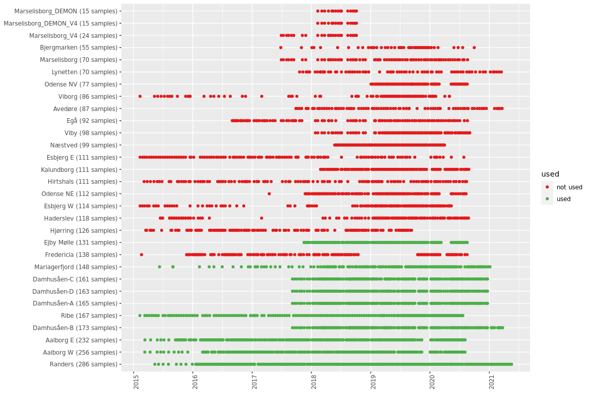
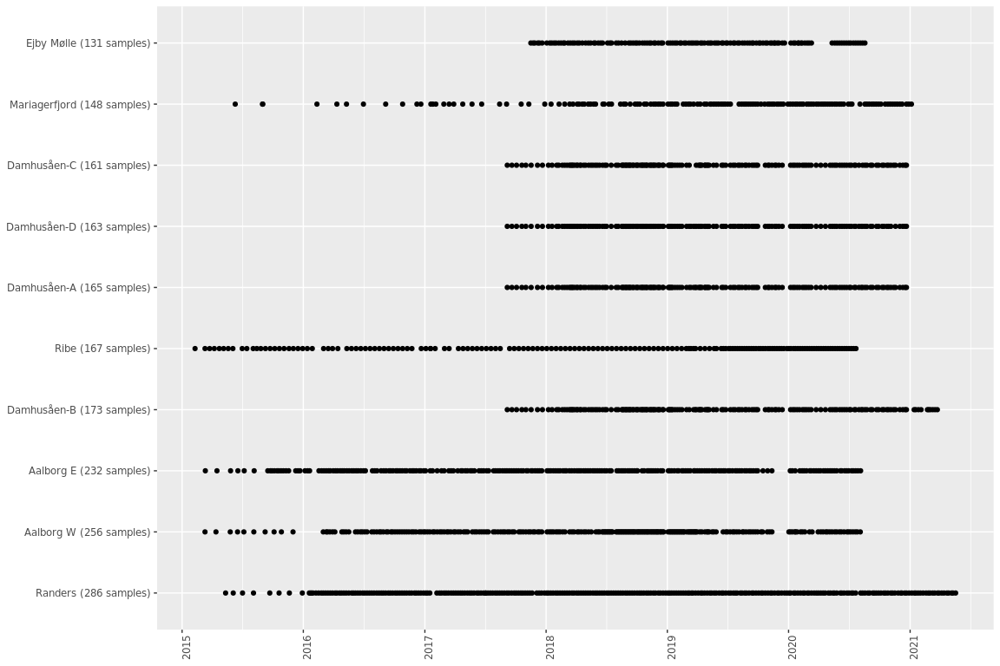
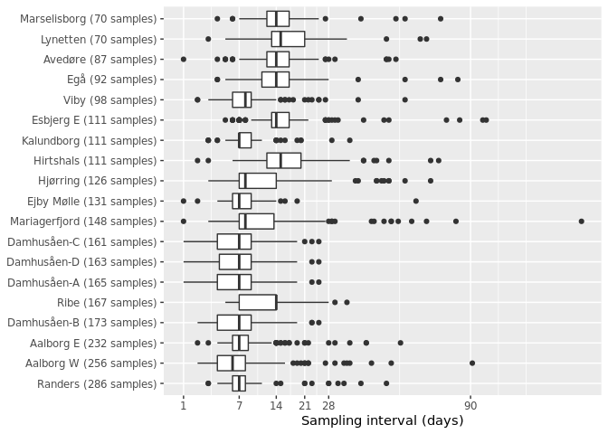

init
====

    #load data
    library(ampvis2)

    ## Loading required package: ggplot2

    library(openxlsx)
    library(data.table)
    library(tidyverse)

    ## Warning in system("timedatectl", intern = TRUE): running command 'timedatectl'
    ## had status 1

    ## ── Attaching packages ─────────────────────────────────────── tidyverse 1.3.1 ──

    ## ✔ tibble  3.1.6     ✔ dplyr   1.0.7
    ## ✔ tidyr   1.1.4     ✔ stringr 1.4.0
    ## ✔ readr   2.1.0     ✔ forcats 0.5.1
    ## ✔ purrr   0.3.4

    ## ── Conflicts ────────────────────────────────────────── tidyverse_conflicts() ──
    ## ✖ dplyr::between()   masks data.table::between()
    ## ✖ dplyr::filter()    masks stats::filter()
    ## ✖ dplyr::first()     masks data.table::first()
    ## ✖ dplyr::lag()       masks stats::lag()
    ## ✖ dplyr::last()      masks data.table::last()
    ## ✖ purrr::transpose() masks data.table::transpose()

    if (interactive()) {
      if (!grepl("data$", getwd())) {
        setwd("data")
      }
    }

This markdown filters samples, makes sure sample metadata is correct,
and splits the data into one dataset per WWTP.

Load metadata
=============

    rm(list=ls())
    gc()

    ##           used  (Mb) gc trigger (Mb) max used  (Mb)
    ## Ncells 2235121 119.4    4529538  242  2840880 151.8
    ## Vcells 3745777  28.6    8388608   64  5996463  45.8

    metadata <- fread("metadata/metadata.txt")

    if (any(duplicated(metadata$Sample))) {
      stop("One or more sample name(s) are duplicated in sample metadata. Please fix manually")
    }

    #filter a few useless samples
    metadata <- filter(metadata, !Sample %chin% paste0("MQ201110-", 309:311))
    metadata$Date <- lubridate::dmy(metadata$Date)
    metadata$Year <- as.character(lubridate::year(metadata$Date))

    #### add seasonal period and week number ####
    #extract seasonal periods from dates
    WS <- as.Date("2012-12-15", format = "%Y-%m-%d") # Winter Solstice
    SE <- as.Date("2012-3-15",  format = "%Y-%m-%d") # Spring Equinox
    SS <- as.Date("2012-6-15",  format = "%Y-%m-%d") # Summer Solstice
    FE <- as.Date("2012-9-15",  format = "%Y-%m-%d") # Fall Equinox

    # Convert dates from any year to 2012 dates
    dates <- as.Date(strftime(metadata$Date, format = "2012-%m-%d"))
    #extract periods and set factors for correct chronological order
    metadata$Period <- ifelse (dates >= WS | dates < SE, "Winter", #winter
                                  ifelse (dates >= SE & dates < SS, "Spring", #spring
                                          ifelse (dates >= SS & dates < FE, "Summer", "Fall"))) #summer, fall
    metadata$Period <- factor(metadata$Period, levels = c("Spring", "Summer", "Fall", "Winter"))

    metadata <- tibble::add_column(metadata,
                                   Week = as.character(lubridate::isoweek(metadata$Date)),
                                   .after = "Date")

    setDT(metadata)
    #### fix Plant and ID columns ####
    # controls
    metadata[grepl("extneg", tolower(LibID)), ID := "EXTNEG"]
    metadata[grepl("extneg", tolower(LibID)), Plant := "CTRL"]
    metadata[grepl("pcrpor", tolower(LibID)), ID := "PCRPOS"]
    metadata[grepl("pcrpos", tolower(LibID)), Plant := "CTRL"]
    metadata[grepl("pcrneg", tolower(LibID)), ID := "PCRNEG"]
    metadata[grepl("pcrneg", tolower(LibID)), Plant := "CTRL"]
    metadata <- metadata[!is.na(Plant)] #this removes the weird LibID samples: MQ181023-148, MQ181203-218, MQ181214-138, MQ190919-270
    metadata <- metadata[!Sample %chin% "MQ201110-248"]
    metadata[Plant == "Avedoere", Plant := "Avedøre"]
    metadata[Plant == "Damhusaaen", Plant := "Damhusåen"]
    metadata[Plant == "Ejby Moelle", Plant := "Ejby Mølle"]
    metadata[Plant == "Hjoerring", Plant := "Hjørring"]
    metadata[Plant == "Naestved", Plant := "Næstved"]
    metadata[Plant == "Egaa", Plant := "Egå"]
    metadata[grepl("^Dam", ID) & !grepl("CTRL", Plant), Plant := paste0("Damhusåen-", Line)]
    metadata[Plant %chin% "Damhusåen", Plant := paste0("Damhusåen-", Line)]
    metadata[ID == "Lynetten", Plant := "Lynetten"]
    metadata[ID == "Avedøre", Plant := "Avedøre"]
    #metadata[is.na(Plant) & is.na(Line), Plant := ID]

    #make sure date column is parsed correctly (year-month-day prefered) and
    #sort chronologically, abundances will be sorted according to metadata by amp_load
    metadata <- arrange(metadata, Plant, Date)

merge Aalborg West+East temperatures (by weekly average) with metadata
======================================================================

    # Aalborg East
    AAEtemps <- data.table::fread("metadata/AalborgEastTemperatures.csv")
    colnames(AAEtemps) <- c("DateTime.Temperature", "Temperature")
    AAEtemps <- AAEtemps[!is.na(DateTime.Temperature) & !is.na(Temperature)] #filter empty ones
    AAEtemps[,DateTime.Temperature := lubridate::mdy_hm(DateTime.Temperature)] #parse dates
    AAEtemps[,DateTime.Temperature := lubridate::floor_date(DateTime.Temperature, unit = "day")] #floor to day (remove HM)
    AAEtemps[,Year := as.character(lubridate::year(DateTime.Temperature))] #extract year
    AAEtemps[,Week := as.character(lubridate::isoweek(DateTime.Temperature))] #extract week (ISO standard)
    AAEtemps[,DateTime.Temperature := as.character(DateTime.Temperature)] #coerce back to character
    AAEtemps <- AAEtemps[,.(week_mean_temperature = mean(Temperature)),keyby=.(Year, Week)] #sometimes multiple measurements per week
    AAEtemps[,Plant := "Aalborg E"]

    # Aalborg West
    AAWtemps <- data.table::fread("metadata/AalborgWestTemperatures.csv")
    colnames(AAWtemps) <- c("DateTime.Temperature", "Temperature")
    AAWtemps <- AAWtemps[!is.na(DateTime.Temperature) & !is.na(Temperature)] #filter empty ones
    AAWtemps[,DateTime.Temperature := lubridate::mdy_hm(DateTime.Temperature)] #parse dates
    AAWtemps[,DateTime.Temperature := lubridate::floor_date(DateTime.Temperature, unit = "day")] #floor to day (remove HM)
    AAWtemps[,Year := as.character(lubridate::year(DateTime.Temperature))] #extract year
    AAWtemps[,Week := as.character(lubridate::isoweek(DateTime.Temperature))] #extract week (ISO standard)
    AAWtemps[,DateTime.Temperature := as.character(DateTime.Temperature)] #coerce back to character
    AAWtemps <- AAWtemps[,.(week_mean_temperature = mean(Temperature)),keyby=.(Year, Week)] #sometimes multiple measurements per week
    AAWtemps[,Plant := "Aalborg W"]

    temps <- data.table::rbindlist(list(AAEtemps, AAWtemps))

    metadata_merged <- dplyr::left_join(
      metadata,
      temps,
      by = c("Plant", "Year", "Week")
    )
    metadata_out <- dplyr::filter(
      metadata_merged,
      !Plant %chin% c("EXTNEG", "PCRPOS", "PCRNEG", "", "CTRL"),
      !Line %chin% c("HC-O", "HC-U")
    )
    data.table::fwrite(metadata_out, "metadata.csv")

load amplicon data
==================

    d <- amp_load(
      otutable = "amplicon_data/ASVtable.tsv.zip",
      metadata = metadata_out,
      taxonomy = "amplicon_data/ASVs.R1.midas481.sintax.zip")

    ## Warning: Only 3708 of 4075 unique sample names match between metadata and otutable. The following unmatched samples have been removed:
    ## otutable (367): 
    ##  "MQ181116-127", "MQ181116-128", "MQ181116-129", "MQ181116-130", "MQ181116-124", "MQ181116-125", "MQ1806029-153", "MQ1806029-180", "MQ181023-102", "MQ181023-150", "MQ181023-201", "MQ181023-252", "MQ181023-51", "MQ181116-215", "MQ181116-236", "MQ181116-238", "MQ181116-240", "MQ181116-281", "MQ181116-322", "MQ181123-173", "MQ181123-239", "MQ181123-241", "MQ181123-334", "MQ181123-86", "MQ190111-91", "MQ190919-112", "MQ190919-134", "MQ190919-162", "MQ190919-217", "MQ190919-272", "MQ190919-55", "MQ190919-57", "MQ1806029-152", "MQ1806029-179", "MQ181023-101", "MQ181023-149", "MQ181023-200", "MQ181023-251", "MQ181023-50", "MQ181116-214", "MQ181116-237", "MQ181116-239", "MQ181116-280", "MQ181116-321", "MQ181123-172", "MQ181123-238", "MQ181123-240", "MQ181123-333", "MQ181123-85", "MQ190111-90", "MQ190919-111", "MQ190919-133", "MQ190919-161", "MQ190919-216", "MQ190919-271", "MQ190919-54", "MQ190919-56", "MQ190301-201", "MQ190301-202", "MQ190301-203", "MQ201118-133", "MQ201118-134", "MQ201118-135", "MQ201118-184", "MQ201118-185", "MQ201118-186", "MQ201204-1", "MQ201204-2", "MQ201204-3", "MQ201204-4", "MQ201204-5", "MQ201204-6", "MQ201204-7", "MQ201204-8", "MQ201204-9", "MQ201204-10", "MQ201204-11", "MQ201204-12", "MQ201204-13", "MQ201204-14", "MQ201204-15", "MQ201204-16", "MQ201204-17", "MQ201204-18", "MQ201204-19", "MQ201204-20", "MQ201204-21", "MQ201204-22", "MQ201204-23", "MQ201204-24", "MQ201204-25", "MQ201204-26", "MQ201204-27", "MQ201204-28", "MQ201204-29", "MQ201204-30", "MQ201204-31", "MQ201204-32", "MQ201204-33", "MQ201204-34", "MQ201204-35", "MQ201204-36", "MQ201204-37", "MQ201204-38", "MQ201204-39", "MQ201204-40", "MQ201204-41", "MQ201204-42", "MQ201204-43", "MQ201204-44", "MQ201204-45", "MQ201204-46", "MQ201204-47", "MQ201204-48", "MQ201204-49", "MQ201204-50", "MQ201204-51", "MQ201204-52", "MQ201204-53", "MQ201204-54", "MQ201204-55", "MQ201204-56", "MQ201204-57", "MQ201204-58", "MQ201204-59", "MQ201204-60", "MQ201204-61", "MQ201204-62", "MQ201204-63", "MQ201204-64", "MQ201204-65", "MQ201204-66", "MQ201204-67", "MQ201204-68", "MQ201204-69", "MQ201204-70", "MQ201204-71", "MQ201204-72", "MQ201204-73", "MQ201204-74", "MQ201204-75", "MQ201204-76", "MQ201204-77", "MQ201204-78", "MQ201204-79", "MQ201204-80", "MQ201204-81", "MQ201204-82", "MQ201204-83", "MQ201204-84", "MQ201204-85", "MQ201204-86", "MQ181116-123", "MQ181123-171", "MQ181123-237", "MQ181123-332", "MQ181123-84", "MQ190111-89", "MQ201009-123", "MQ201009-124", "MQ201009-125", "MQ201009-126", "MQ201009-127", "MQ201009-128", "MQ201009-129", "MQ201009-130", "MQ201009-131", "MQ201009-132", "MQ201009-133", "MQ201009-134", "MQ201009-135", "MQ201009-136", "MQ201009-137", "MQ201009-138", "MQ201009-139", "MQ201009-140", "MQ201009-141", "MQ201009-142", "MQ201009-143", "MQ201009-144", "MQ201009-145", "MQ201009-146", "MQ201009-147", "MQ201009-148", "MQ201009-149", "MQ201009-150", "MQ201009-151", "MQ201009-152", "MQ201009-153", "MQ201009-154", "MQ201009-155", "MQ201009-156", "MQ201009-157", "MQ201009-158", "MQ201009-159", "MQ201009-160", "MQ201009-161", "MQ201009-162", "MQ201009-163", "MQ201009-164", "MQ201009-165", "MQ201009-166", "MQ201009-167", "MQ201009-168", "MQ201009-169", "MQ201009-170", "MQ201009-171", "MQ201009-172", "MQ201009-173", "MQ201009-174", "MQ201009-175", "MQ201009-176", "MQ201009-177", "MQ201009-178", "MQ201009-179", "MQ201009-180", "MQ201009-181", "MQ201009-182", "MQ201009-183", "MQ201030-31", "MQ201030-32", "MQ201030-54", "MQ210618-83", "MQ210618-84", "MQ210618-85", "MQ210618-98", "MQ210618-99", "MQ210618-100", "MQ210618-196", "MQ210618-197", "MQ210618-198", "MQ200121-54", "MQ200121-55", "MQ200121-56", "MQ201009-77", "MQ201009-78", "MQ201009-79", "MQ200528-102", "MQ200528-103", "MQ200528-104", "MQ200528-161", "MQ200528-162", "MQ200528-163", "MQ201009-268", "MQ201009-269", "MQ201009-270", "MQ201009-296", "MQ201009-297", "MQ201009-298", "MQ201019-275", "MQ201019-276", "MQ201019-277", "MQ200420-101", "MQ200420-102", "MQ200420-103", "MQ210115-197", "MQ210115-198", "MQ210115-199", "MQ210118-34", "MQ210118-57", "MQ210118-70", "MQ210118-71", "MQ210118-72", "MQ210129-24", "MQ210129-33", "MQ210129-34", "MQ210129-35", "MQ201110-223", "MQ201110-224", "MQ201110-225", "MQ201110-185", "MQ201110-186", "MQ201110-187", "MQ201009-31", "MQ201009-32", "MQ201009-33", "MQ200928-65", "MQ200928-66", "MQ200928-67", "MQ181203-218", "MQ181203-219", "MQ181203-220", "MQ181214-138", "MQ181214-139", "MQ181214-140", "MQ181214-192", "MQ181214-193", "MQ181214-194", "MQ181214-195", "MQ181214-196", "MQ181221-278", "MQ181221-279", "MQ181221-280", "MQ181221-281", "MQ190107-131", "MQ190107-132", "MQ190107-133", "MQ190107-134", "MQ190107-135", "MQ190107-136", "MQ190107-137", "MQ190107-215", "MQ190107-216", "MQ190107-217", "MQ190301-272", "MQ190301-273", "MQ190301-274", "MQ190301-275", "MQ190301-276", "MQ190301-277", "MQ190301-278", "MQ190412-153", "MQ190412-154", "MQ190702-175", "MQ190702-176", "MQ190702-177", "MQ190702-199", "MQ190702-200", "MQ190919-110", "MQ190919-132", "MQ190919-160", "MQ190919-215", "MQ190919-270", "MQ190919-53", "MQ191010-305", "MQ191010-306", "MQ191115-233", "MQ191115-234", "MQ191115-235", "MQ191115-236", "MQ201110-248", "MQ201110-268", "MQ201110-309", "MQ201110-310", "MQ201110-311", "MQ201030-152", "MQ201030-154", "MQ201030-155", "MQ201030-242", "MQ201030-243", "MQ201030-244", "MQ220104-209", "MQ220104-210", "MQ220104-211", "MQ211213-141", "MQ211213-142", "MQ211213-143", "MQ210129-80", "MQ210129-81", "MQ210129-82", "MQ210129-106", "MQ210129-130", "MQ210129-131", "MQ210129-132", "MQ210219-231", "MQ210219-264", "MQ210219-265", "MQ210219-266", "MQ210219-315", "MQ210219-316", "MQ210219-317", "MQ210219-318", "MQ210414-86", "MQ210414-87", "MQ210414-88", "MQ210503-56", "MQ210503-57"

remove samples with few reads, and normalise reads to sample total
==================================================================

    ds <- d %>%
      amp_subset_samples(minreads = 1000, removeAbsents = TRUE, normalise = TRUE)

    ## 97 samples and 5 OTUs have been filtered 
    ## Before: 3708 samples and 90117 OTUs
    ## After: 3611 samples and 90112 OTUs

    gc()

    ##             used   (Mb) gc trigger  (Mb)   max used    (Mb)
    ## Ncells   2480487  132.5    4529538   242    4529538   242.0
    ## Vcells 517126904 3945.4 3033659472 23145 3775050384 28801.4

    datasets <- c(
      "Aalborg E",
      "Aalborg W",
      "Avedøre",
      "Damhusåen-A",
      "Damhusåen-B",
      "Damhusåen-C",
      "Damhusåen-D",
      "Egå",
      "Ejby Mølle",
      "Esbjerg E",
      "Hirtshals",
      "Hjørring",
      "Kalundborg",
      "Lynetten",
      "Mariagerfjord",
      "Marselisborg",
      "Randers",
      "Ribe",
      "Viby"
    )

Select and create data subsets
==============================

    dlist <- lapply(
      datasets,
      function(wwtp) {
        #filter
        dataset <- amp_subset_samples(
          ds,
          Plant %chin% wwtp,
          normalise = FALSE
        ) %>%
          filter_otus(0.1)

        dataset_folder <- paste0("datasets/", wwtp)
        dir.create(dataset_folder, recursive = TRUE, showWarnings = FALSE)

        #write out abundance table
        fwrite(
          data.table(
            ASV = rownames(dataset$abund),
            dataset$abund
          ),
          file = paste0(dataset_folder, "/ASVtable.csv")
        )

        #write out taxonomy
        fwrite(
          dataset$tax,
          file = paste0(dataset_folder, "/taxonomy.csv")
        )

        #write out metadata
        fwrite(
          dataset$metadata,
          file = paste0(dataset_folder, "/metadata.csv")
        )

        dataset
      }
    )

    ## 3379 samples and 39754 OTUs have been filtered 
    ## Before: 3611 samples and 90112 OTUs
    ## After: 232 samples and 50358 OTUs

    ## 364 OTUs not present in more than 0.1% relative abundance in any sample have been filtered 
    ## Before: 50358 OTUs
    ## After: 49994 OTUs

    ## 3355 samples and 42879 OTUs have been filtered 
    ## Before: 3611 samples and 90112 OTUs
    ## After: 256 samples and 47233 OTUs

    ## 474 OTUs not present in more than 0.1% relative abundance in any sample have been filtered 
    ## Before: 47233 OTUs
    ## After: 46759 OTUs

    ## 3524 samples and 53472 OTUs have been filtered 
    ## Before: 3611 samples and 90112 OTUs
    ## After: 87 samples and 36640 OTUs

    ## 1944 OTUs not present in more than 0.1% relative abundance in any sample have been filtered 
    ## Before: 36640 OTUs
    ## After: 34696 OTUs

    ## 3446 samples and 45375 OTUs have been filtered 
    ## Before: 3611 samples and 90112 OTUs
    ## After: 165 samples and 44737 OTUs

    ## 125 OTUs not present in more than 0.1% relative abundance in any sample have been filtered 
    ## Before: 44737 OTUs
    ## After: 44612 OTUs

    ## 3438 samples and 43198 OTUs have been filtered 
    ## Before: 3611 samples and 90112 OTUs
    ## After: 173 samples and 46914 OTUs

    ## 1514 OTUs not present in more than 0.1% relative abundance in any sample have been filtered 
    ## Before: 46914 OTUs
    ## After: 45400 OTUs

    ## 3450 samples and 45063 OTUs have been filtered 
    ## Before: 3611 samples and 90112 OTUs
    ## After: 161 samples and 45049 OTUs

    ## 733 OTUs not present in more than 0.1% relative abundance in any sample have been filtered 
    ## Before: 45049 OTUs
    ## After: 44316 OTUs

    ## 3448 samples and 43700 OTUs have been filtered 
    ## Before: 3611 samples and 90112 OTUs
    ## After: 163 samples and 46412 OTUs

    ## 660 OTUs not present in more than 0.1% relative abundance in any sample have been filtered 
    ## Before: 46412 OTUs
    ## After: 45752 OTUs

    ## 3519 samples and 46908 OTUs have been filtered 
    ## Before: 3611 samples and 90112 OTUs
    ## After: 92 samples and 43204 OTUs

    ## 241 OTUs not present in more than 0.1% relative abundance in any sample have been filtered 
    ## Before: 43204 OTUs
    ## After: 42963 OTUs

    ## 3480 samples and 50175 OTUs have been filtered 
    ## Before: 3611 samples and 90112 OTUs
    ## After: 131 samples and 39937 OTUs

    ## 0 OTU's have been filtered.

    ## 3500 samples and 52727 OTUs have been filtered 
    ## Before: 3611 samples and 90112 OTUs
    ## After: 111 samples and 37385 OTUs

    ## 188 OTUs not present in more than 0.1% relative abundance in any sample have been filtered 
    ## Before: 37385 OTUs
    ## After: 37197 OTUs

    ## 3500 samples and 55745 OTUs have been filtered 
    ## Before: 3611 samples and 90112 OTUs
    ## After: 111 samples and 34367 OTUs

    ## 145 OTUs not present in more than 0.1% relative abundance in any sample have been filtered 
    ## Before: 34367 OTUs
    ## After: 34222 OTUs

    ## 3485 samples and 54412 OTUs have been filtered 
    ## Before: 3611 samples and 90112 OTUs
    ## After: 126 samples and 35700 OTUs

    ## 2780 OTUs not present in more than 0.1% relative abundance in any sample have been filtered 
    ## Before: 35700 OTUs
    ## After: 32920 OTUs

    ## 3500 samples and 62455 OTUs have been filtered 
    ## Before: 3611 samples and 90112 OTUs
    ## After: 111 samples and 27657 OTUs

    ## 0 OTU's have been filtered.

    ## 3541 samples and 57886 OTUs have been filtered 
    ## Before: 3611 samples and 90112 OTUs
    ## After: 70 samples and 32226 OTUs

    ## 1261 OTUs not present in more than 0.1% relative abundance in any sample have been filtered 
    ## Before: 32226 OTUs
    ## After: 30965 OTUs

    ## 3463 samples and 50983 OTUs have been filtered 
    ## Before: 3611 samples and 90112 OTUs
    ## After: 148 samples and 39129 OTUs

    ## 116 OTUs not present in more than 0.1% relative abundance in any sample have been filtered 
    ## Before: 39129 OTUs
    ## After: 39013 OTUs

    ## 3541 samples and 56554 OTUs have been filtered 
    ## Before: 3611 samples and 90112 OTUs
    ## After: 70 samples and 33558 OTUs

    ## 0 OTU's have been filtered.

    ## 3325 samples and 38865 OTUs have been filtered 
    ## Before: 3611 samples and 90112 OTUs
    ## After: 286 samples and 51247 OTUs

    ## 226 OTUs not present in more than 0.1% relative abundance in any sample have been filtered 
    ## Before: 51247 OTUs
    ## After: 51021 OTUs

    ## 3444 samples and 50086 OTUs have been filtered 
    ## Before: 3611 samples and 90112 OTUs
    ## After: 167 samples and 40026 OTUs

    ## 0 OTU's have been filtered.

    ## 3513 samples and 51081 OTUs have been filtered 
    ## Before: 3611 samples and 90112 OTUs
    ## After: 98 samples and 39031 OTUs

    ## 420 OTUs not present in more than 0.1% relative abundance in any sample have been filtered 
    ## Before: 39031 OTUs
    ## After: 38611 OTUs

overview of samples over time (all)
===================================

    m <- data.table(ds$metadata)
    m[, used := ifelse(Plant %chin% datasets, "used", "not used")]

    #append number of samples to plant/dataset names
    m[, nsamples_plant := .N, by = Plant]
    m[, Plant := paste0(Plant, " (", nsamples_plant, " samples)")]

    #order datasets by the number of samples (extracted from dataset names)
    nsamples <- m[,unique(Plant)] %>%
      #extract pattern: (123 samples)
      stringi::stri_extract_all_regex(
        "\\([0-9]+ samples\\)$"
      ) %>%
      #extract pattern: 0-9
      stringi::stri_extract_all_regex(
        "[0-9]+"
      ) %>%
      as.numeric
    plants_ordered <- m[,unique(Plant)][order(nsamples, decreasing = TRUE)]
    m[,Plant := factor(Plant, levels = plants_ordered)]

    samples_overview_all <- ggplot(
      m,
      aes(x = Date,
          y = Plant,
          color = used)) +
      geom_point() +
      scale_x_date(date_breaks = "year", date_labels = "%Y") +
      scale_color_manual(values = RColorBrewer::brewer.pal(3, "Set1")[c(1, 3)]) +
      theme(
        axis.title = element_blank(),
        axis.text.x = element_text(angle = 90))

    samples_overview_all

    ## Warning: Removed 4 rows containing missing values (geom_point).

overview of samples over time (only those selected for the paper)
=================================================================

    samples_overview <- ggplot(m[used == "used"], aes(Date, Plant)) +
      geom_point() +
      scale_x_date(date_breaks = "year", date_labels = "%Y") +
      theme(
        axis.title = element_blank(),
        axis.text.x = element_text(angle = 90))
    samples_overview

    ## Warning: Removed 3 rows containing missing values (geom_point).

Overview of sampling intervals
==============================

    sampling_intervals <- ggplot(
      m[
        used == "used",
        .(duration = .SD[!duplicated(Date), as.numeric(diff(sort(Date)))]),
        by = Plant
      ],
      aes(duration, Plant)
    ) +
      geom_boxplot() +
      theme(axis.title.y = element_blank()) +
      xlab("Sampling interval (days)") +
      scale_x_continuous(trans = "sqrt", breaks = c(1,7,14,21,28,90))
    sampling_intervals

